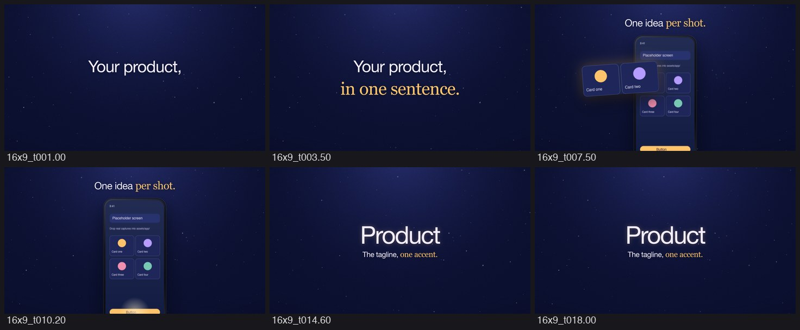

# launch-film

A Claude Code skill for Apple-style product launch films rendered frame by frame in code.

An HTML page paints any moment through `window.__seek(t)`; headless Chrome captures the frames (one process per
worker, 4-sample motion blur) and ffmpeg encodes them. Cuts lock to the measured beat grid of a generated score.
ElevenLabs makes the music, voiceover and sound effects, Gemini or GPT the art, and speech-to-text checks every voice
line, because the agent cannot listen. A still-by-still critique loop keeps the quality up.



## Install

```sh
npx skills add Dwite/launch-film -g        # with the skills CLI (skills.sh); drop -g for one project
# or
git clone https://github.com/Dwite/launch-film ~/.claude/skills/launch-film
```

Claude Code picks the skill up in every project (a global install) or in the one project (a project install). Ask for "a launch film for <product>" or run `/launch-film`.

Requirements: Google Chrome (the renderer points at the macOS path; edit `CHROME` in `template/scripts/render.mjs`
elsewhere), ffmpeg, Node 18+, Python 3 with Pillow, and [uv](https://docs.astral.sh/uv/). Keys in the environment:
`ELEVENLABS_API_KEY` for music, voice, sound effects and speech-to-text; optionally `GEMINI_API_KEY` and
`OPENAI_API_KEY` for images.

## Start a film

```sh
bash ~/.claude/skills/launch-film/new_film.sh ~/films/my-product    # or ./.claude/skills/launch-film/ for a project install
cd ~/films/my-product
node scripts/render.mjs stills 1,4,8,12,18 && python3 scripts/sheet.py review/stills review/sheet.jpg 5 400
node scripts/render.mjs video --fps 60 --sub 4 --shutter 0.5 --workers 12 --out out/master.mp4
```

The template is a working 20-second film (kinetic title → phone with a pop-out card and a tap → end card). Timing
lives in `timeline.json`, which the page and the audio scripts both read, so picture and sound never drift apart.

## What is inside

| Path | Role |
| --- | --- |
| `SKILL.md` | The workflow the agent follows: study → brief → score → stills and critique → animatic → voice → mix → final. |
| `references/craft.md` | Brand, shot, motion and sound rules. |
| `references/pitfalls.md` | Bugs already paid for (rendering determinism, 3D flattening, audio stutter, sidechain truncation…). |
| `template/src/stage.js` | Shots as pure functions of time; springs and helpers in `src/lib/motion.js`. |
| `template/scripts/render.mjs` | Stills, previews and final renders with motion blur. |
| `template/scripts/gen_music.py`, `analyze_music.py` | Timed-section scores and measurement (tempo, grid, bass entries, levels). |
| `template/scripts/gen_vo.py`, `qa_speech.py` | Voiceover placed by measured word timings; transcription checks. |
| `template/scripts/gen_sfx.py`, `mix_audio.py` | Sound effects; per-cue loudness, ducking, −14 LUFS. |

## Credits

Built from two X articles: leo's "Make your product videos look expensive (Apple Framework)" and 0xMovez's "How to
build a motion design studio with Opus 5.5", and from the lessons of a real 62-second launch film.

MIT license.
